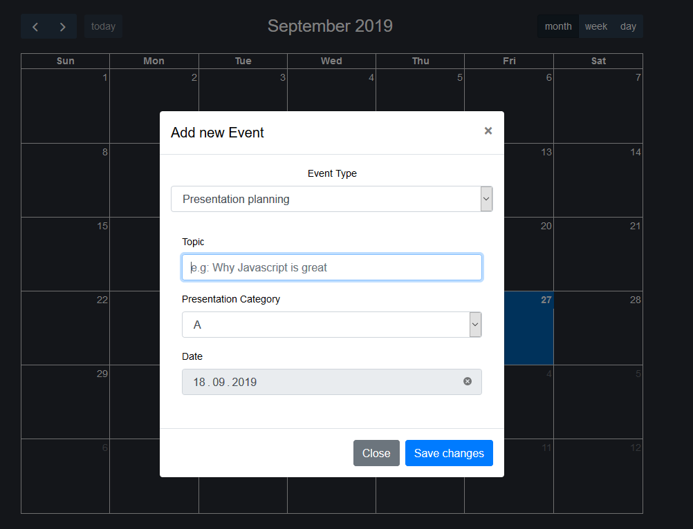

# Colloquium Selector Robot
> Automating tedious planning.


CSR is designed to simplify the process of planning and scheduling Presentations.
It helps by automating the process of picking a presenter, tracking Presentation amount + Type, while also being fair to everyone and 
spreading Presentations equally. CSR is meant to streamline and make annoying tasks like scheduling easy by taking the burden away from you.
On top of the features described above you can run CSR at your own k8s cluster easily. Just take a look at the k8s-manifests folder for further reference.
Support for "Docker Swarm" is comming soon.



## Installation

Requisites:
```
NodeJS
Git
```
Windows:
```
git clone Repo
navigate to API folder in Commandline
run npm install

navigate to Webapp folder in Commandline
run npm install

run npm start in API folder
run npm start in Webapp folder

get started coding !

```
## Environment Variables

API:
```
    Database

DB_HOST (default: localhost)
DB_USER (default: root)
DB_PASSWORD 
DB_DATABASE_NAME (default: csr_db)
DB_PORT (default: 3306)
DOMAIN_NAME (default: http://localhost:3000/)

    Mailgun

API_KEY
PROXY
DOMAIN (default: mail.domain.tld)
HOST (default: api.eu.mailgun.net)
SENDER_MAIL

api/app.js

app.use(logger('dev')); comment out for production

var corsOptions = {
	allowedHeaders: 'Content-Type, Access-Control-Allow-Origin',
	origin: 'http://localhost:3000', // change to webapp domain name
	allowedMethods: 'POST,GET'
};


```

Webapp
```
NODE_ENV (default: development)


variables.js

API_URL (default: http://localhost:8000/)

```
## Build Version
Webapp
1. npm install
2. npm run-script build 
3. start static server with the files in the build folder

API
1. npm install
2. set NODE_ENV to production
3. npm start
## Release History

* 1.0
    * initial release 

## Meta

Philipp Braun – [@Github](https://github.com/lippielip) – lippiebraun@gmail.com  
Hannes Norbert Göring – [@Github](https://github.com/pitscher) – mail@hn-goering.com

Distributed under no license yet...

## Contributing

1. Clone it (<https://github.com/lippielip/CSR.git>)
2. Create your feature branch (`git checkout -b feature/fooBar`)
3. Commit your changes (`git commit -am 'Add some fooBar'`)
4. Push to the branch (`git push origin feature/fooBar`)

<!-- Markdown link & img dfn's -->
[npm-image]: https://img.shields.io/npm/v/datadog-metrics.svg?style=flat-square
[npm-url]: https://npmjs.org/package/datadog-metrics
[npm-downloads]: https://img.shields.io/npm/dm/datadog-metrics.svg?style=flat-square
[travis-image]: https://img.shields.io/travis/dbader/node-datadog-metrics/master.svg?style=flat-square
[travis-url]: https://travis-ci.org/dbader/node-datadog-metrics
[wiki]: https://github.com/yourname/yourproject/wiki
